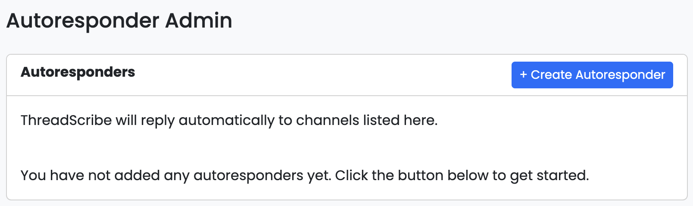
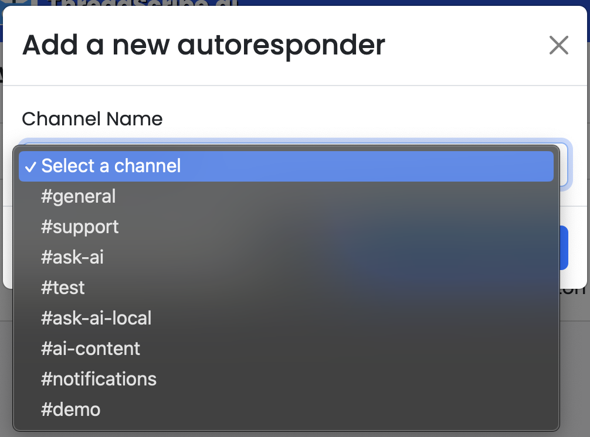
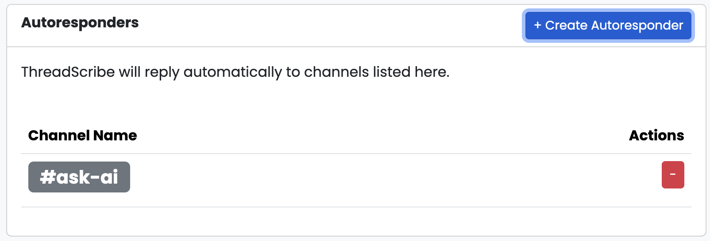
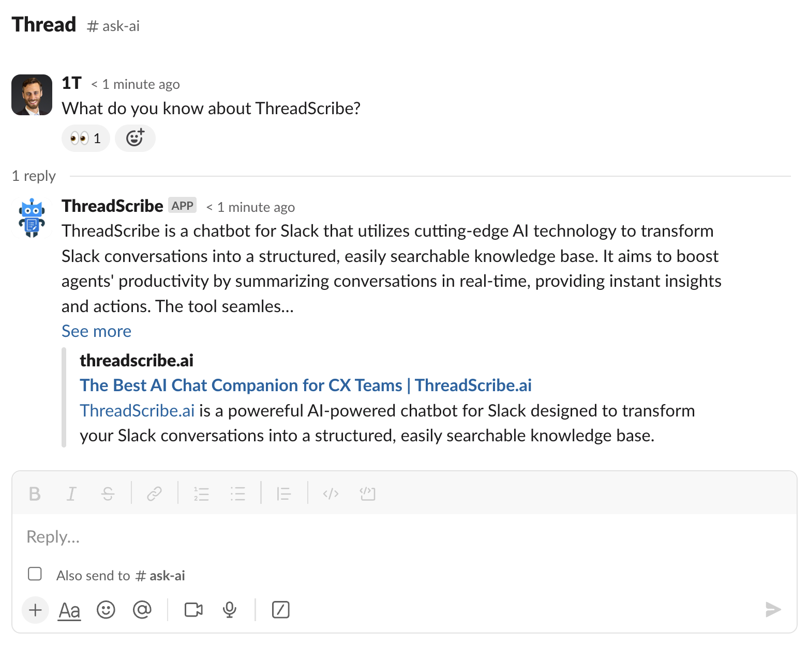

import { Aside, Steps } from "@astrojs/starlight/components";

## What are Autoresponders?

Autoresponders in ThreadScribe are powerful tools designed to automatically respond to messages within specific channels, 
such as a dedicated `#ask-ai` channel in Slack. This feature allows ThreadScribe to monitor the channel and provide instant 
responses to any questions or queries posted, without requiring users to explicitly mention ThreadScribe via `@ThreadScribe`. 
By setting up an autoresponder, you can ensure that your team has immediate access to the information they need, 
enhancing productivity and reducing response times.

## Configuring Autoresponders in ThreadScribe

<Aside>Autoresponders are available in our Business and Enterprise plans.</Aside>

Follow these steps to configure autoresponders in the ThreadScribe admin interface:

<Steps>

1. ## Access the admin interface

    Navigate to the admin interface at https://app.threadscribe.ai and log in.

2. ## Create an autoresponder

    Click on `Responders` and then `+ Create Responders` button

    

      
    

    You'll be presented with a modal that allows you to select a channel.
    ThreadScribe will autorespond to all messages in this selected channel.
    Select the appropriate channel for your workspace (We suggest using something like `#ask-threadscribe` or `#ask-ai`).

    

      
    

    Click save and your channel should now be listed on the list of autoresponders.

    

      
    

3. ## Test your autoresponder

    In the channel you selected in Step 2, ask any question without mentioning ThreadScribe.
    You should see the eyes emoji (👀) and a response from ThreadScribe in seconds.

    

      
    

</Steps>
