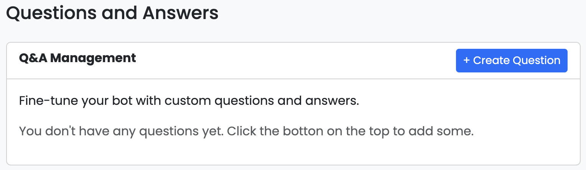
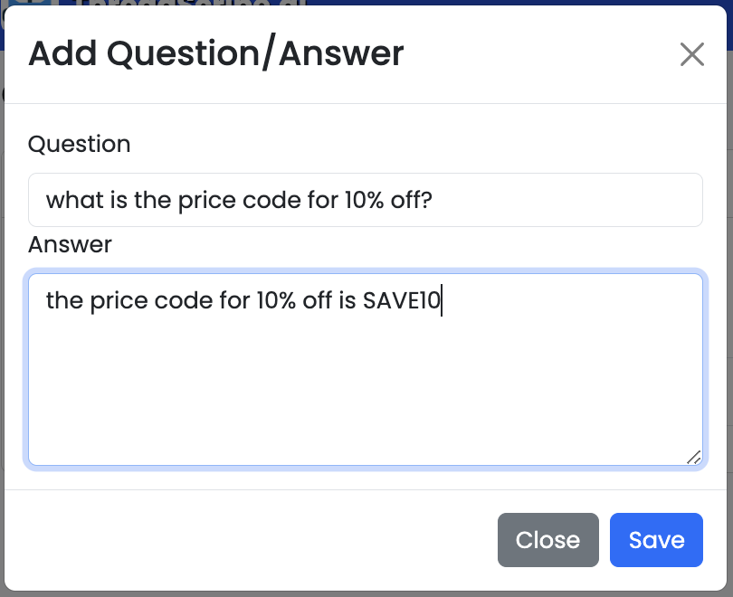
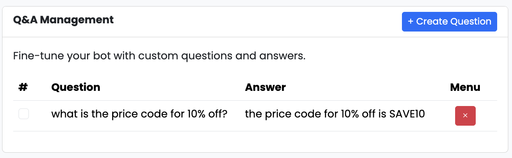
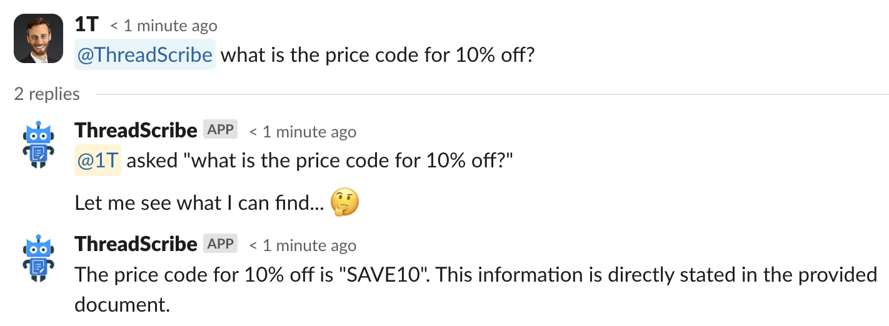

import { Aside, Steps } from "@astrojs/starlight/components";

## What is Q&A?

The Q&A feature in ThreadScribe allows users to fine-tune their copilot by 
providing specific question-and-answer response pairs. This customization 
enhances the copilot’s ability to respond accurately and contextually to 
queries, making it a more effective tool for retrieving information and 
assisting users.

## Configuring Q&A

<Aside>Custom questions and answers are available in our Business and Enterprise plans.</Aside>

<Steps>

1. ## Access the admin interface

    Navigate to the admin interface at https://app.threadscribe.ai and log in.

2. ## Create Q&A

    Click on `Q&A` and then `+ Create Question`.

    

      
    

    Type in your question and answer and click `Save`.

    

      
    

    Your question and answer are now part of your knowledge base.

    

      
    

3. ## Test it!

    Ask ThreadScribe about the knowledge you just added to the knowledge base.
    

      
    

</Steps>