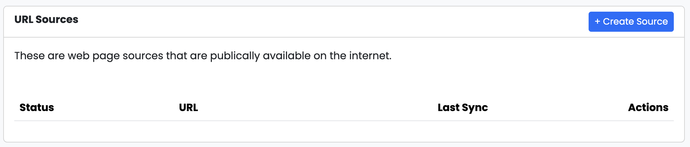
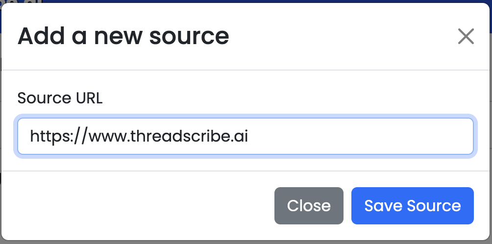
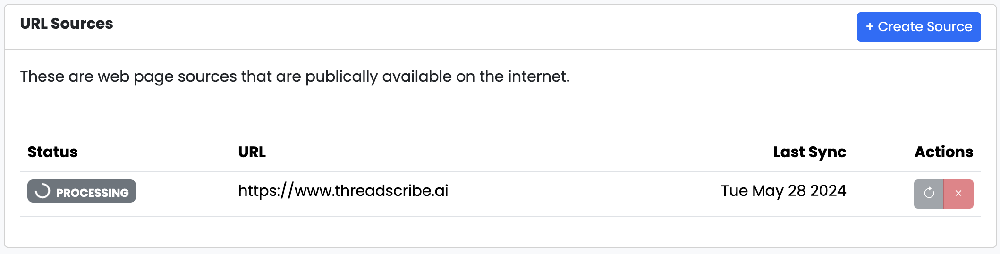
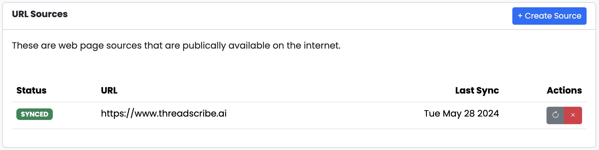
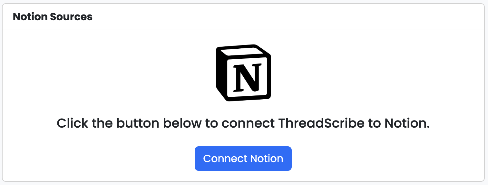
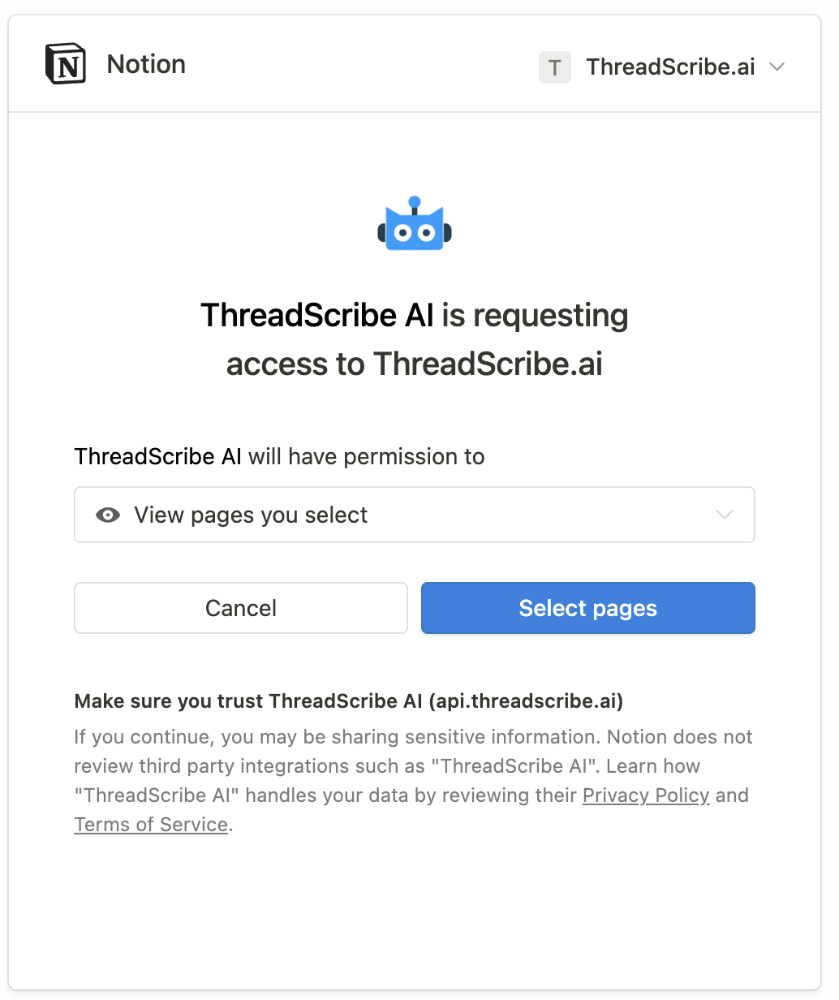
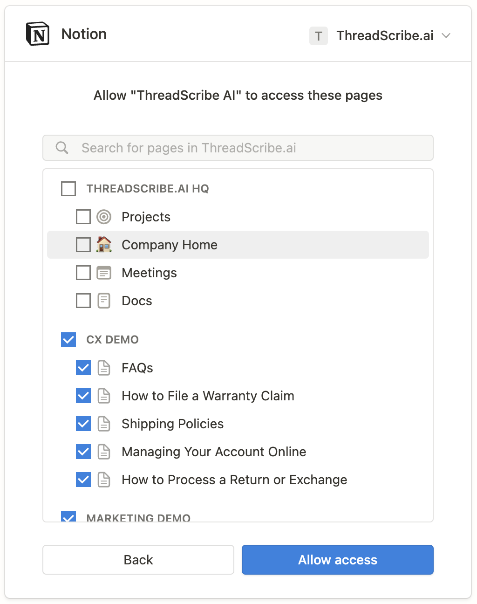
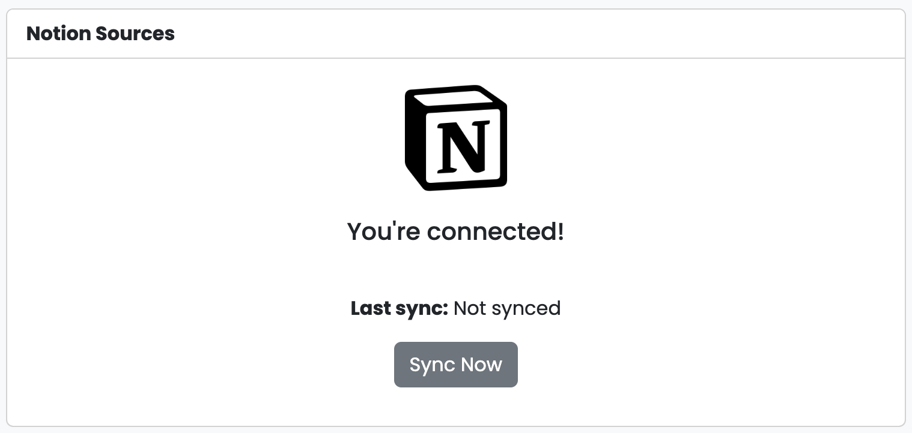
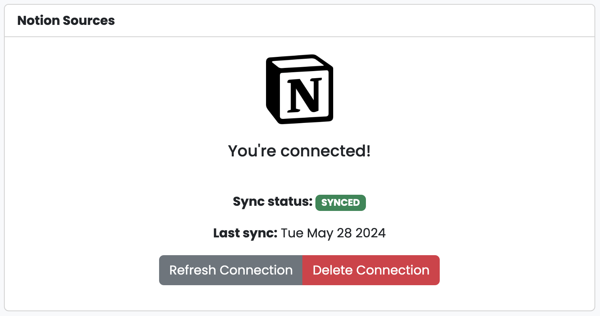

import { Aside, Steps } from "@astrojs/starlight/components";

## What are data sources

In ThreadScribe, "Additional Data Sources" refer to various platforms and 
repositories beyond the primary tools that ThreadScribe integrates with, 
such as Slack and Notion. These additional data sources can include other 
collaborative tools, databases, and document storage systems that contain 
valuable information your team needs to access and manage. By connecting 
these additional data sources to ThreadScribe, you can expand the reach 
of your searches and ensure comprehensive data retrieval across your organization.

## Benefits of Adding Additional Data Sources

<Aside>Additional data sources are available in our Business and Enterprise plans.</Aside>

* **Unified Search:** Consolidate data from multiple sources, allowing users to
perform searches that span across all integrated platforms.
* **Increased Efficiency:** Reduce the time spent switching between different 
tools and platforms to find information.
* **Improved Data Accessibility:** Ensure that critical information is easily accessible, regardless of where it is stored.
* **Enhanced Collaboration:** Facilitate better collaboration by making all relevant data available in one place.

## Adding a web source

### What is a web source?

A web source in ThreadScribe refers to any publicly accessible website or 
online resource that can be included as part of your data retrieval process. 
These web sources can be anything from industry blogs, forums, knowledge bases, 
to official documentation sites. 

### Configuring a web source

<Steps>

1. ## Access the admin interface

    Navigate to the admin interface at https://app.threadscribe.ai and log in.

2. ## Create a web source

    In the sidebar navigation click `Sources` then `+ Create Source`.

    

      
    

    In the modal, enter your URL. This could be your website, knowledge base, or blog.

    

      
    

    Click `Save Source`. Once saved, ThreadScribe will begin processing your web source. 
    Depending on the size of the site and number of pages, this could take anywhere between a few seconds and a few minutes.

    

      
    

    Once processed the status will change to `SYNCED`. ThreadScribe will now consider this information when responding to queries.

    

      
    

</Steps>

## Adding a Notion source

### What is a Notion source?

A Notion source in ThreadScribe refers to the integration of [Notion](https://www.notion.com), 
a popular collaboration and note-taking tool, with ThreadScribe's data 
retrieval system. By adding Notion as a source, ThreadScribe can index and search 
through your Notion pages, databases, and content. This enables your team to access 
and retrieve information stored in Notion directly from ThreadScribe.

### Configuring a Notion Source

<Steps>

1. ## Access the admin interface

    Navigate to the admin interface at https://app.threadscribe.ai and log in.

2. ## Create a Notion source

    Click on `Sources` then `Connect Notion`. This will initiate the authentication
    process between ThreadScribe and your Notion workspace.

    

      
    

    Review the permissions being requested and click `Select Pages`.

    <Aside>ThreadScribe requires read-only access in order to ingest your Notion workspace.</Aside>

    

      
    

    On the following dialog, select the pages that should be added to your ThreadScribe knowledge base.
    You can select some or all of your pages.

    

      
    

    Once connected, click `Sync now`

    

      
    

    Now ThreadScribe is synced to your Notion. You're all set!

    

      
    

</Steps>