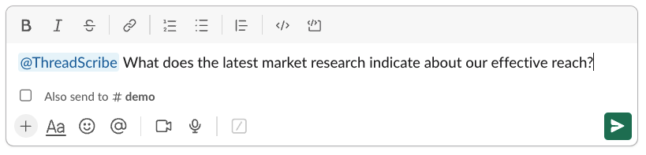

Getting started with ThreadScribe is a straightforward process.

import { Aside, Steps } from "@astrojs/starlight/components";

<Steps>
1. ## Install the ThreadScribe Copilot

    Click [HERE](https://bot.threadscribe.ai/slack/install) here to install the ThreadScribe app to your workspace. Authorize it by clicking `Allow`.

    

      
    

    ThreadScribe will react with the eyes emoji (👀) which indicates that it has received the request.

2. ## Start summarizing

    Find a lengthly thread and ask, `@ThreadScribe can you summarize this for me?`

    

    Your summary will be generated and posted to the chat.

    

    <Aside>Summaries generally take about 5-10 second to generate, depending on the length of the thread. If no response is received, please let us know by contacting us via [support](/support/).</Aside>

3. ## Search your summaries

    In a channel that ThreadScribe is in, you can ask it any question.
    
    For example, `@ThreadScribe What does the latest market research indicate about our effective reach?`

    

    ThreadScribe will react with the eyes emoji (👀) which indicates that it has received the request. It will then post the response directly to the slack thread.

    

4. ## View and manage your summaries

    You can view manage your summaries by navigating to our admin UI, [https://app.threadscribe.ai](https://app.threadscribe.ai).

    

      
    

</Steps>

