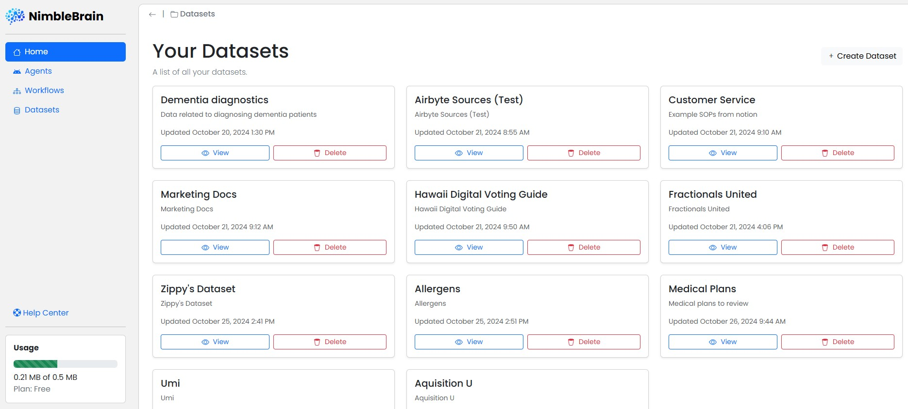
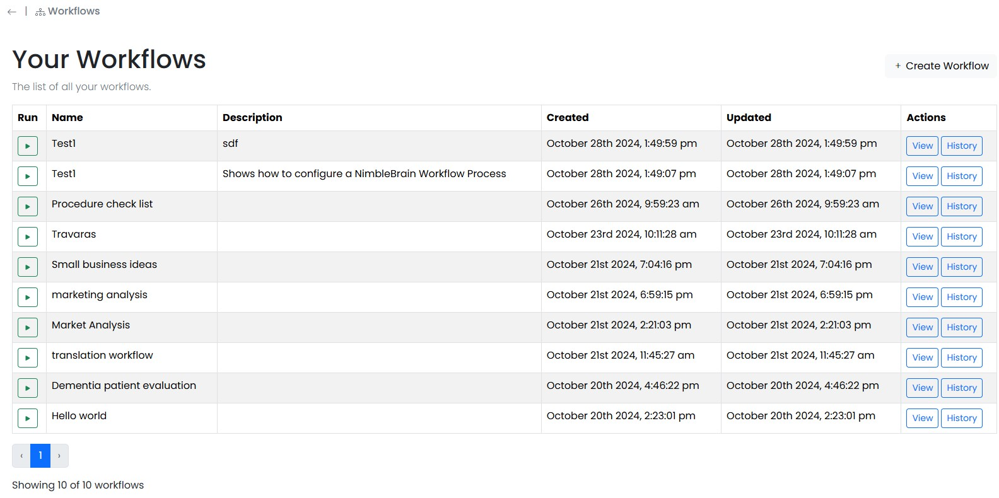

Getting started with NimbleBrain is a straightforward and quick process. 

To work with NimbleBrain, simply upload your **Dataset**, configure your **Agnet** or **Workflow** and then unlock the power of your data.

import { Aside, Steps } from "@astrojs/starlight/components";

<Steps>
1. ## Log in to NimbleBrain

    Click [HERE](https://accounts.nimblebrain.ai/sign-up?redirect_url=https%3A%2F%2Fapp.nimblebrain.ai%2F) to sign up for NimbleBrain. Fill in your information and complete it by clicking `Continue`.

    If you already have an account, click [HERE](https://accounts.nimblebrain.ai/sign-in?redirect_url=https%3A%2F%2Fapp.nimblebrain.ai%2F) to  sign back into your account. Then open the application by clicking `Continue`.)
    

      
    

    After successfully entering your email and password, you will be redirected to the homepage of the NimbleBrain application.

2. ## Configuring Datasets

    On the Homepage, on the left hand side, select `Datasets` 

    

    Once selected, you will be redirected to the **Datasets** page and should see all of the datasets created thus far.

    

    To create a new Dataset, click `+ Create Dataset` and enter your **Dataset Name** and **Description** then click `Create Dataset` once completed.

    #### Creating a Source of Data
    Once your Dataset configured, you need to upload your data by selecting ` + Create Source`.
    
    On the screen you will see a window with multiple potential sources like **Airtable**, **Notion**, **Slack**, **PDF**, **CSV**, **TXT**, **URL**, and more. Select the source you will be utilizing by simply clicking on the source.

    
    
    Once a source has been selected, name your file and provide a file description accordingly. Then select you file by clicking `Choose File` under the **Select File** section. You will see a window pop up to select you file. Once the file is chosen, upload your source by clicking the `Upload File` button.
    
    <Aside>Individual data sources are generally limited to a maximum of 5MB per file. If the file exceeds 5MB, try breaking the source up to minimize the file size. If no response is received, please let us know by contacting us via [support](/support/).</Aside>

    Once your Source has been uploaded, you should see all uploaded sources in your Dataset. From there you can create additional sources by repeating the process or deleting your sources by selecting `Delete` under the respective source.

3. ## Configuring Agents

   To interact with your **Datasets** you need to configure an **Agent**. You can do this by selecting `Agents` in the top left Navigation Bar.
    
    You will be redirected to **Your Agents** page with a list of all of your agents.

    

    To create an **Agent** simply press ` + Create Agent` in the top right corner of the page.

    1. **Select Agent:** You will be provided with the option to select two different agent types: **Question and Answer** and **Conversational Agent**. Simply click on the agent that works best for your intended application.

    

    2. **Name Agent:** Once the Agent Type is selected, enter your Agent Name then click `Next`.

    3. **Describe Agent:** From there you will see seven different **Agent Descriptions** that can be used as templates to configure your agent. The final option provides you with the option to generate your agent with AI. Select the **Agent Description** that works best for you by simply clicking on the description.

    

    4. **Add Datasets:** Lastly, Select your **Dataset** that you would like you agent to interact with by clicking on the respective **Dataset**. You may select more than one if desired. Once all **Datasets** are selected, click `Create Agent`.

    

    #### Improving your Agent
    🎆 Your Agent should now be ready to interact with! 🎆

    Before you chat with your agent, you can improve your agent even more by selecting `Configuration` on the top **Navigation Bar**.

    Once the `Configuration` tab has been selected, you will see a description of the **Agent**, the **Dataset**, and an **Agent Scorecard**.

    

    You can edit your agent's description by selecting `Edit` next to your agent's title. From there, you can edit your **Agent Description** and Reselect you **Data Sources**. Once content, select, `Update Agent`.

    ##### Enhance with AI

     On the **Configurations** tab, you will also see your **Agent Scorecard** which is graded on a scale from 0 to 10. The scorecard explains the strengths and weaknesses of your agent's configuration. You may enhance your agent by selecting the `Enhance with AI` button at the <u>bottom</u> of the Agent Scorecard box. 
     
    

     Once selected, you should see your agent scorecard score change adn your agent description change due to the AI enhancements. You can continue to edit these enhancements by selecting `Edit` by the **Agent Title**.

4. ## Interacting with your Agent

    Once your agent is configured, select the `Chat` tab in the top **Navigation Bar** and start a conversation with your agent! interact with your agent by typing your message then clicking `Send`. From there, your agent should interact with you accordingly. 

     

     <Aside>If your agent is not interacting completely as desired, try adjusting your agent's configuration to address any issues with your agent. </Aside>
     
    
5. ## Workflows

    Workflows are a more advanced type of tool powered by NimbleBrain. Like agents, they can access data and perform pre-configured tasks enabled by you, but can perform multiple tasks in a predefined order.

    To start, select `Workflows` in the Navigation Bar in the top left corner of your window.

    To create a new Workflow, simply select `+ Create Workflow` in the top right of the **your
     Workflows** page.

    

    Enter your Workflow Name, Description of your Process, and Instructions. You may also start with a template by selecting the `Start with a Template` button at the top of your window.

    From there, enter your first **Parameter Name** and select one of two **Parameter Types** `Text Input` or `File Upload`. Once completed, select ` + Add Parameter`.

    You should see your list of **Current Parameters** grow at the bottom of your window with each additional parameter added.

    When complete, select `Create Workflow`.

    From there, adjust your tasks for your workflows by adjusting your **Task** order from Start to End.

    

    Configure your **Dataset** on the right hand page of the window. 

    When your Workflow Agent is complete, save your Workflow by selecting `Save` in the top right corner.

    You may also run and test your Workflow Agent by selecting `Run`.

</Steps>

